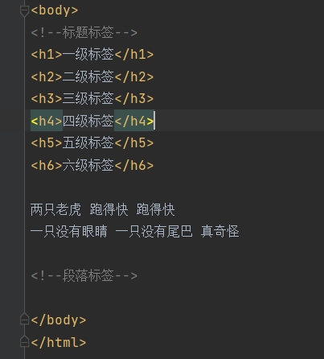
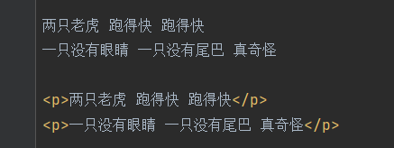
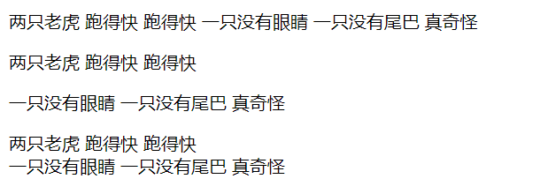
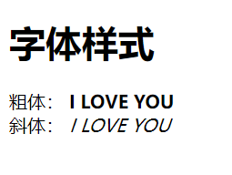

# 学习html
## title标签

页面展示效果如下：

## html的hello world

效果如下

打开该网页源代码，如下如所示  

## 标签学习
### 基本标签
代码如下

展示效果如下

按需调整标签级别即可

### 段落标签
代码如下

效果如下：

本意是想让两只老虎.. 和 一只.. 分成两段，但是html格式不识别这种写法。
当成一句话显示。此时，可以用到段落标签解决。如下：

效果如下

### 换行标签（属于自闭和标签）
代码如下

效果如下

仔细观察，段落标签和换行标签的行距是不一样的

### 水平线标签(属于自闭和标签)
代码如下

效果如下

### 字体样式标签
代码如下

效果如下

### 特殊符号标签
在html的body里，特殊符号必须得用各种字符的代称表示出来，如下图

效果如下

可见空格用&nbsp表示
'>' 用&gt表示
当然不用全部记忆，输入&后，紧接着输入字符会自动联想出来各种字符的代称，如上图