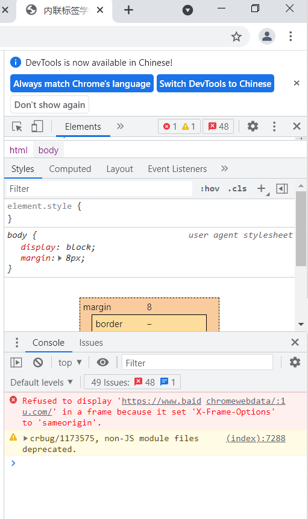

# 内联标签iframe
## 什么是内联标签
iframe标签规定一个内联框架。一个内联框架被用来在当前 HTML 文档中嵌入另一个文档。
iframe一般用来包含别的页面，例如我们可以在我们自己的网站页面加载别人网站的内容。

代码如下：

显示效果如下：

可以看出来，A页面嵌入了B页面

当然，也可以嵌入其他的网页，代码如下：

显示效果如下：

百度的页面拒绝了连接？？？
分析：在网页按F12，看下具体的报错，如下：

'X-Frame-Options' = 'sameorigin'.
百度的Nginx设置了如上的配置，再看看语法，如下：

仅允许同域名的页面嵌套使用！！！

## a标签和iframe标签的联合使用
代码如下：

显示效果如下：

然后点击“点击跳转”，显示效果如下：

