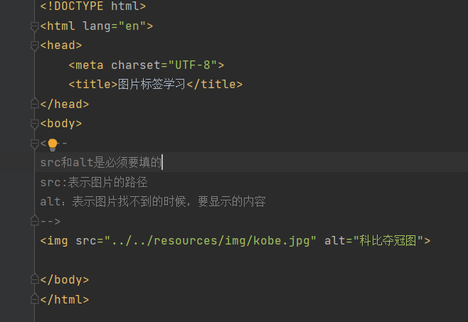
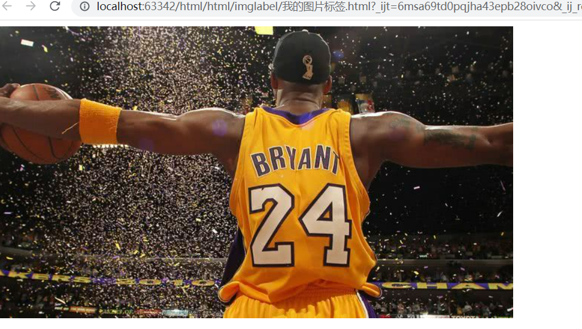
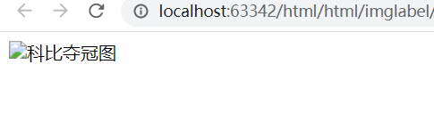
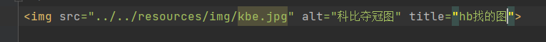
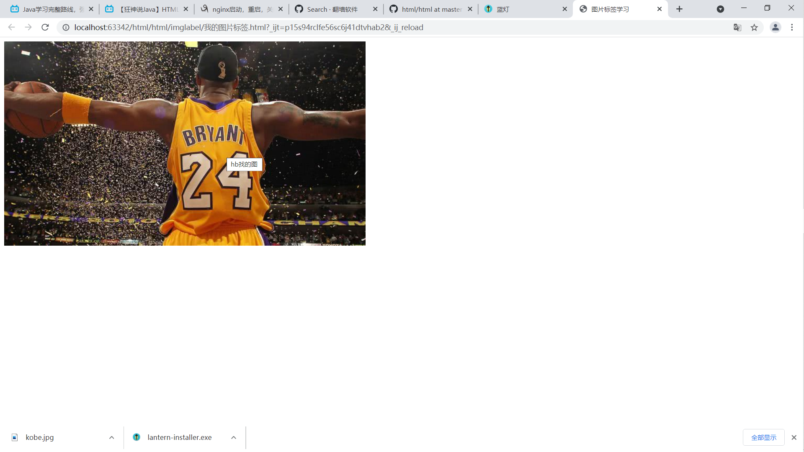
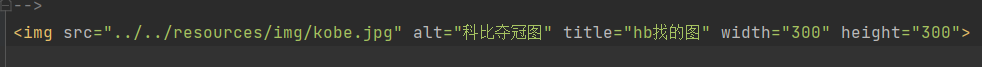
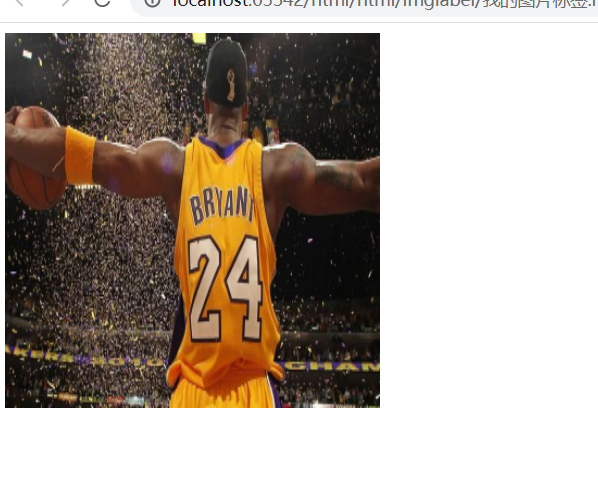

# 图片
## img标签
img标签中，src和alt是必须要填的
src:表示图片的路径
alt：表示图片找不到的时候，要显示的内容
代码如下：

效果如下：

当图片地址不存在时，即找不到图片时，显示效果如下：

显示小图片裂开状态，并显示alt的内容。

## img标签中的text关键字
表示鼠标停留在图片上时，会显示的文字，代码如下：

显示的效果如下：

## img标签中的width和height
代码如下：

效果如下：

其他的可以自己去img标签中查看！！！还有很多标签