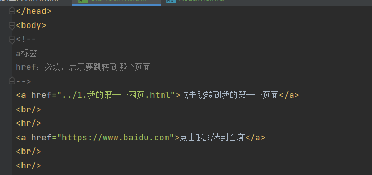
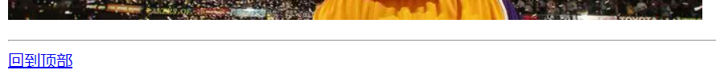

#链接标签
## 文本链接跳转
代码如下：

效果如下：

点击效果如下：
点击“点击跳转到我的第一个页面”跳转效果

点击“点击我跳转到百度”跳转效果

## 图片链接

显示效果如下：

点击“图片”跳转效果

## a标签的target字段

代码如下：

点击效果如下：

从最右边的两个标签页可知，点击时打开了新的窗口

代码如下:

点击“点击我跳转到百度”效果如下

从最右边的标签可知，只有一个标签页，证明再当前页打开的新标签

# 锚标签
代码如下：
标记：

锚链接：

标记显示的效果如下：

锚链接显示的效果如下：

点击“回到顶部”可以跳转到“顶部”！

## 直接跳转到另一个页面的底部

点击“点击我跳转到链接标签页面”可直接跳转到另一个页面的顶部，如下：

现在实现跳转到另一个页面的底部。代码如下：

点击效果如下：

# 功能性链接
## 邮件链接 mailto
代码如下：

效果如下：

点击“点击请联系我”效果如下：

## 举一个qq推广的例子
代码如下：

效果如下，看图片左下角

