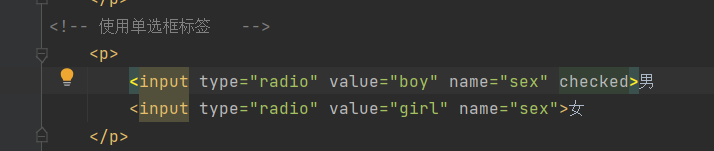
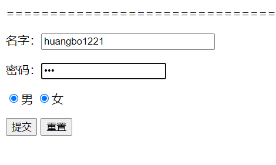
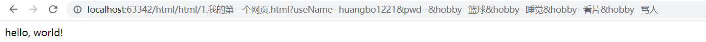

# 表单学习
## 实现用户的登陆输入
代码如下：

表单的标签是form标签，实现文本的输入用input标签，input输入时可以选择文本类型，效果如下：

可见，用户名明文显示，但是密码匿名处理了。

## 实现用户输入的提交与重置
代码如下：

显示效果如下：

type分别为submit和reset，但是按钮上却显示了“提交”和“重置”。默认按钮上显示的文本，
当然也可以指定value值，如下：

## 点击提交时的效果如下：

可以仔细看最右边的两个标签页，跳转到了“1.我的第一个网页.html”。
同时再看看地址栏的输入：http://localhost:63342/html/html/1.%E6%88%91%E7%9A%84%E7%AC%AC%E4%B8%80%E4%B8%AA%E7%BD%91%E9%A1%B5.html?useName=huangbo&pwd=1111111111
input输入标签的userName和pwd跟在了地址后面。这就是get的请求提交方式！！！不安全！！！

## post请求
相较于get请求，相对会更安全，还可以传输大文件。

代码如下：

点击提交的效果如下：

从上图可知，虽然在请求地址里不携带输入参数了。但是在网页的network的Form Data里还是
可以抓到请求参数。针对http方式！

## input标签内的其他参数
value表示默认值
maxLength表示最长能写几个字符
size表示文本框的长度

显示效果如下：

## 单选框标签
用type=“radio”来表示单选框标签，代码如下：
其中男女的name=sex，表示都在同一组，只有都在同一组，才能选择其中一个！！

显示效果如下：

点击“提交”的效果如下：

初始时，男女都没选中，那么是否可以设置默认选中呢？当然可以，如下：

用checked即可，显示效果如下：

若男女的sex不一样？？？则男女都可选中，如下：

点击“提交”效果如下：

## 多选框标签
用checkbox标签来实现多选，代码如下：

显示效果如下：

可见，即使在同一个组，也是都可选中。点击“提交”后的效果如下：

参数里面有多个hobby

## 按钮标签
input type="button" 普通按钮
input type="image"  图像按钮，具有自动提交的功能
input type="submit" 提交
input type="reset"  重置

代码如下：

显示效果如下：

点击“点击变长”没有任何反应，但是点击图片，效果如下：

因为图片有自动提交的功能！

## 下拉框标签
用select标签来表示，option标签来表示多个选项，代码如下：

显示效果如下：

国家默认显示的第一个，即中国！

点击提交效果如下：

可看到列表名称=china！

是否可以设置默认选择新加坡？当然可以，如下：

加上selected即可

效果如下：

## 文本域标签
用textarea表示文本域标签，代码如下：

显示效果如下：代码的“文本内容”默认显示在文本域里

## 文件域标签
用input标签中的type=file标签来显示，代码如下：

显示效果如下：

点击“选择文件”时，效果如下“：

## 其他表单标签
### email
代码如下：

显示效果如下：

输入邮箱然后提交时：

可见经过了简单的校验！

### url
代码如下：

显示效果如下：

输入url然后提交时：

可见经过了简单的校验！

### number
代码如下：

显示效果如下：

填入1000并提交：

右侧的往上加和往下减，步长为1！

### range
代码如下：

显示效果如下：

可以用来控制音量等

### search
代码如下：

效果如下：

